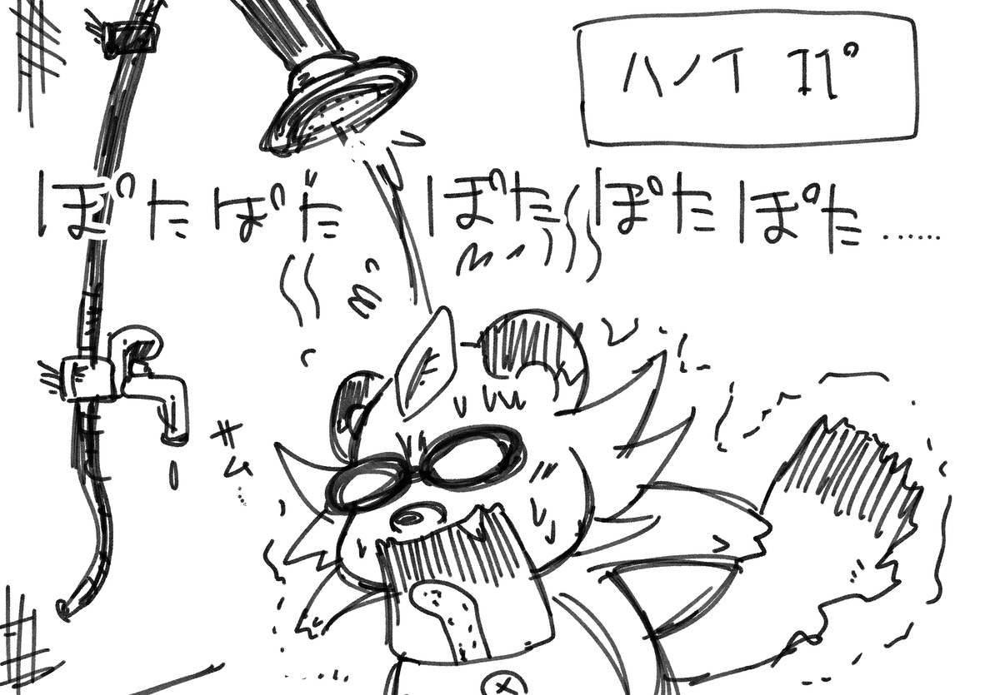
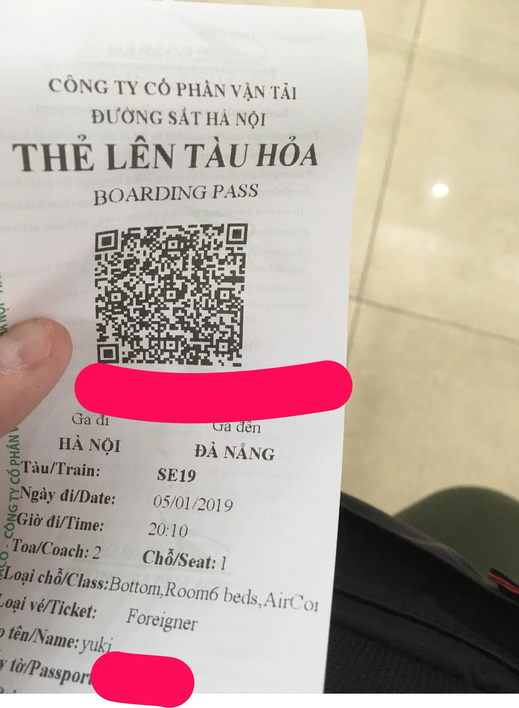
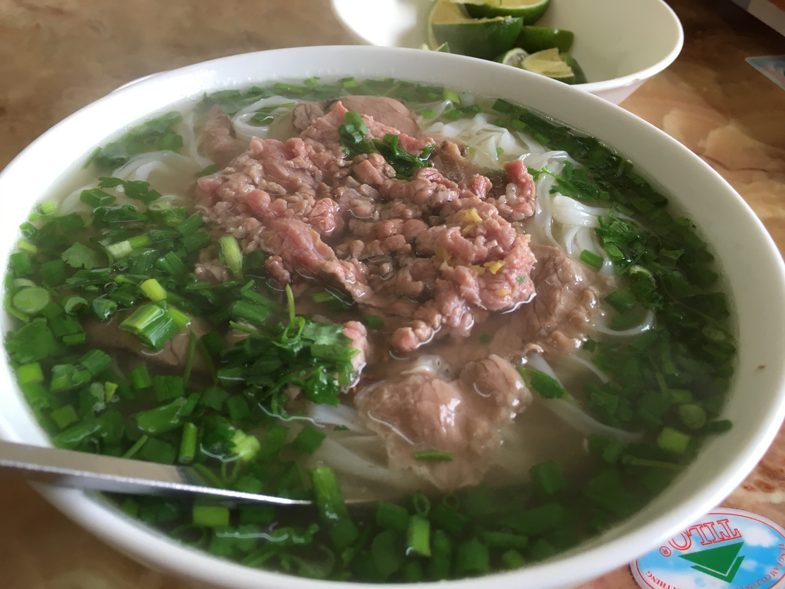
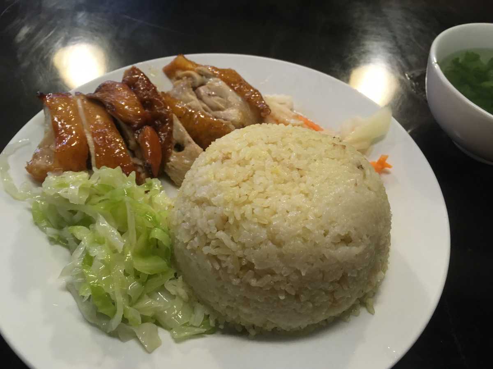
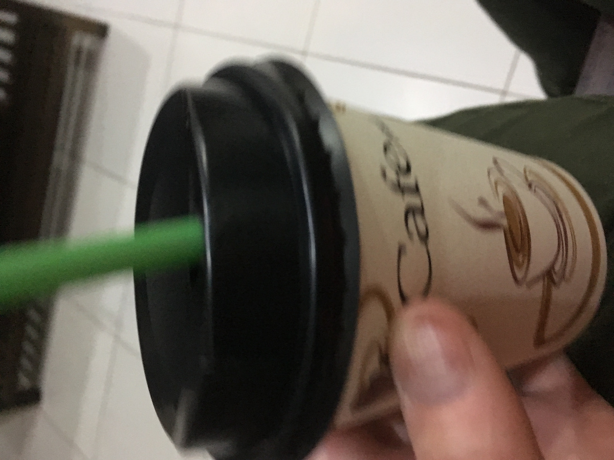

## 2019/01/03 ホットシャワーが出ない
 
 
 
 
 
早朝にハノイ着。SIMカード買って市内までタクる。  
宿にアーリーチェックインしたところ、まだベッドが準備できていないということで、明後日の夜発の電車のチケットを取りました。寒いのでダナンまで一気に南下します。  
  
あと朝ごはんにフォーボーを。牛肉を煮込んであるフォーです。  
パクチーとか野菜を盛るのは南部のスタイルなのでここハノイではライムをかける程度でいただきます。  
こちら3万VNDでした。ドアのない半分屋台は安いぜ。  
  
帰ってきたらベッドの準備完了とのこと。  
寝る前にとりあえずシャワーを借りるとなんとホットシャワーが弱い……髪の毛が短くてもこれは弱すぎる…まじポタポタ…。  
ということで震えながらシャワって寝ました………サムよ早く消えてくれ。  
  
んで昼ごろから夕方まで爆睡。  
写真でも取りに行こうか思ったのですが、ワイは水族館と夜景の撮影が苦手なので今日はなし…。  
ぶらぶら歩いて晩御飯探し。少し冷えるので屋台ではなくちゃんと店に入る。  
コムガーというローストチキンとライスのやつを食べました。ちょっとお高かったけどまあそんなもん。  
  
んで宿の近くのコーヒー屋でベトナムコーヒーをテイクアウトし、今宿で書いてます。  
  
流石に乗り継ぎバス移動&寒さで体力が終わってるので、ぶらぶら旅は明日から。  
なんか水族館があるという情報を聞いたので水族館へ行きます。ベトナムでペンギンが見れるといいな。  

- 宿:一泊10ドル
- フォー:3万VND
- コムガー:6万5千VND
- コーヒー:2万2千VND