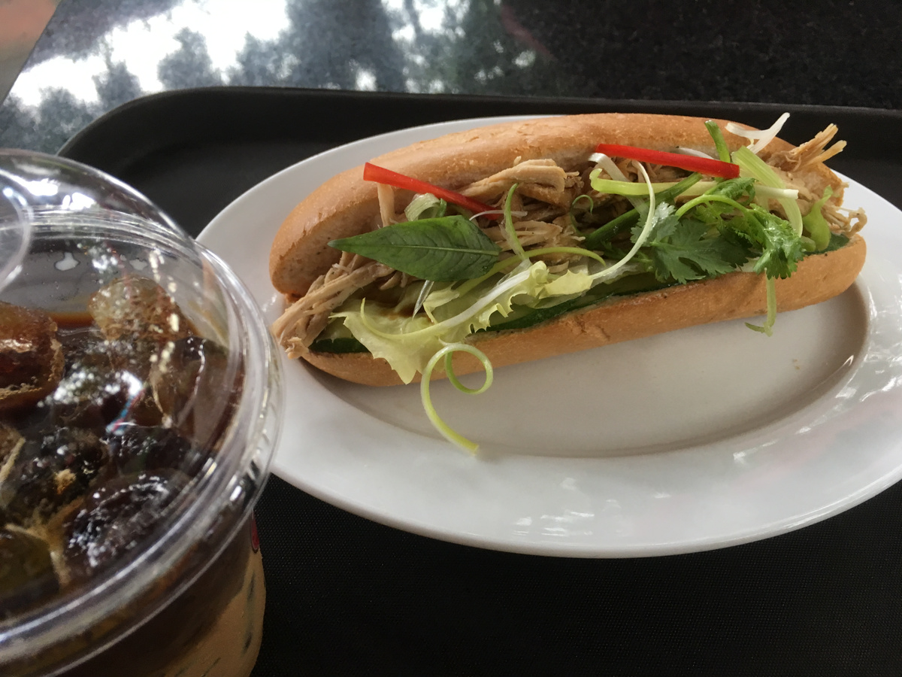
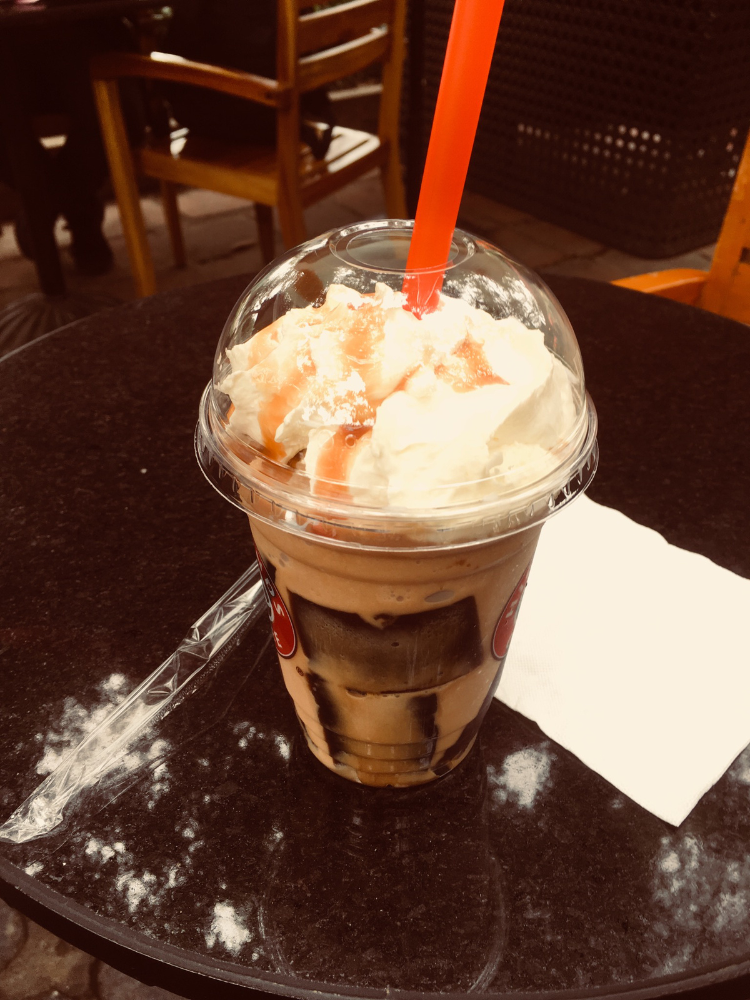
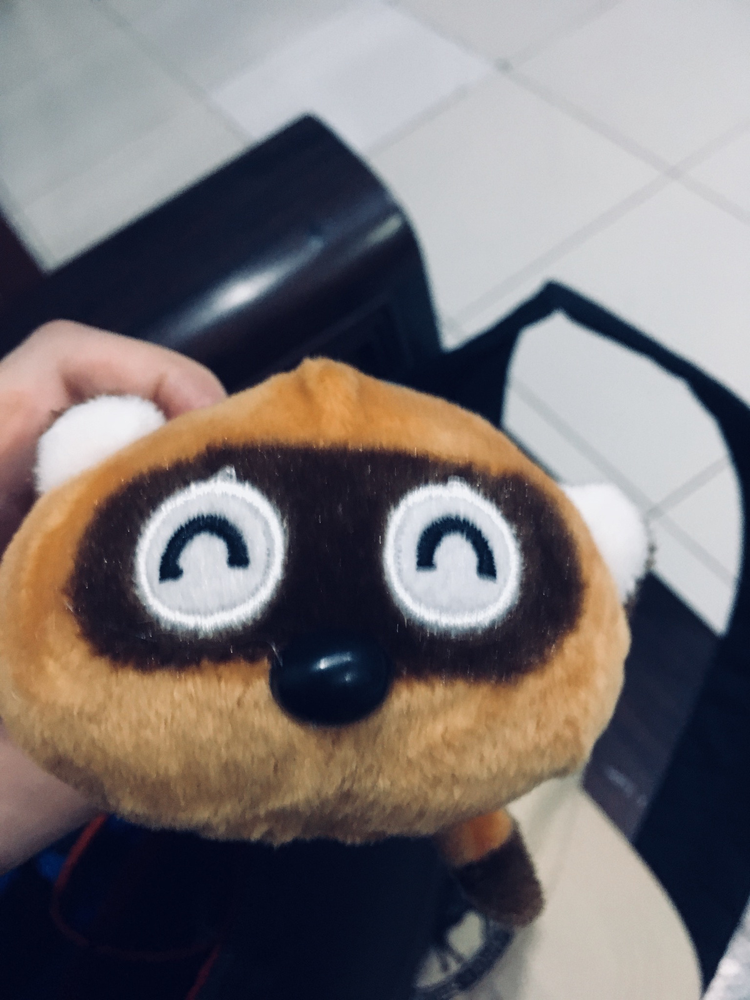
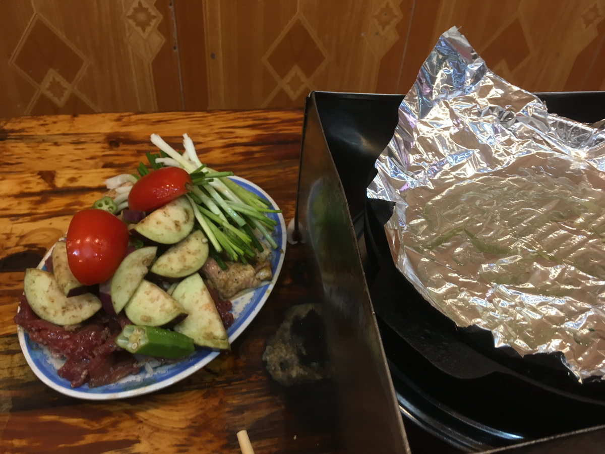
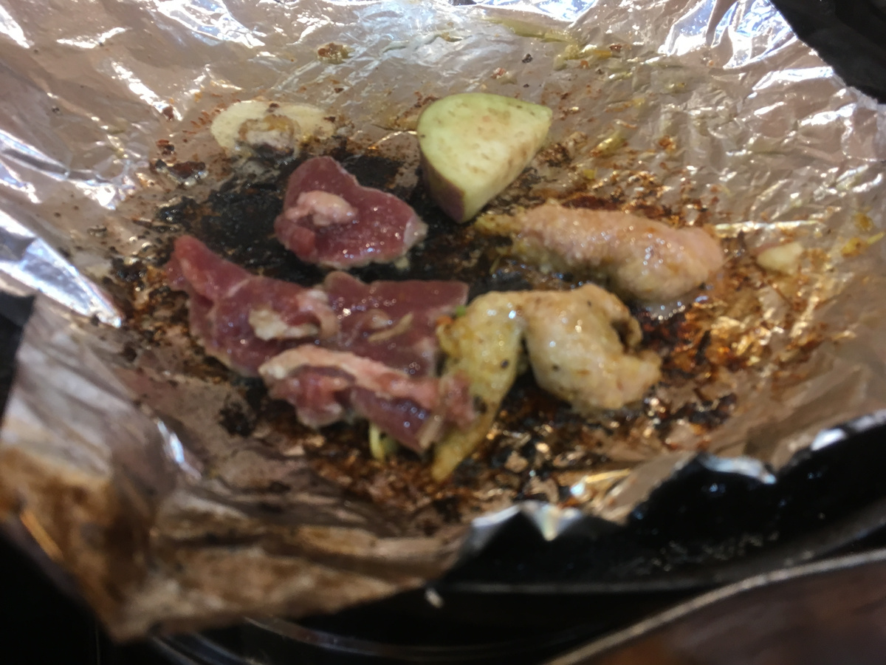
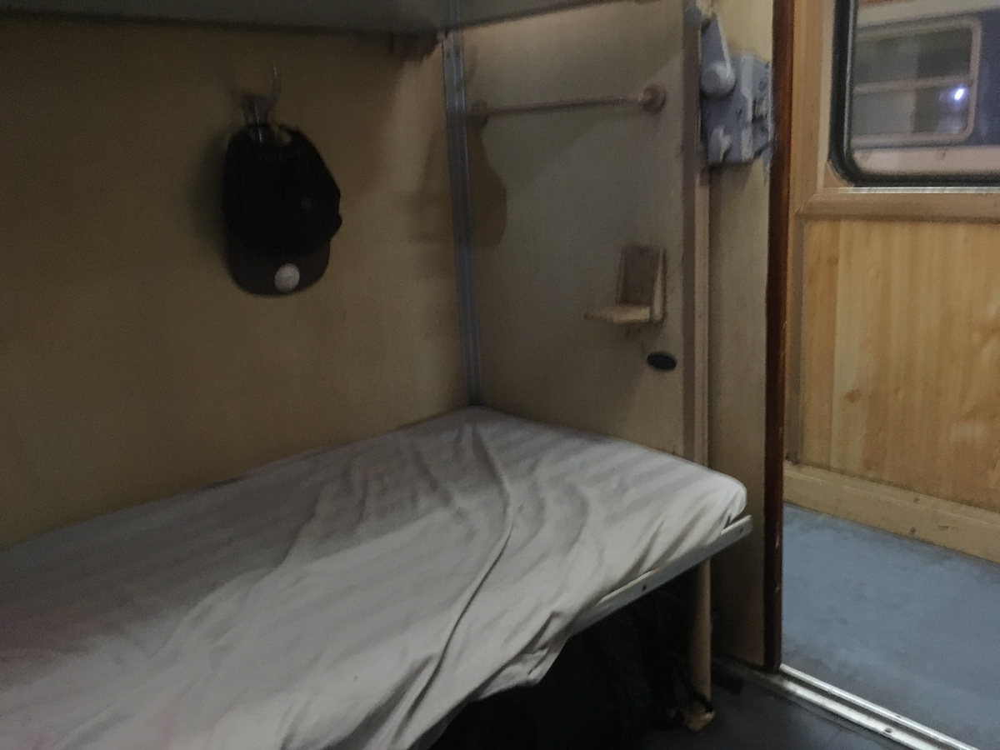
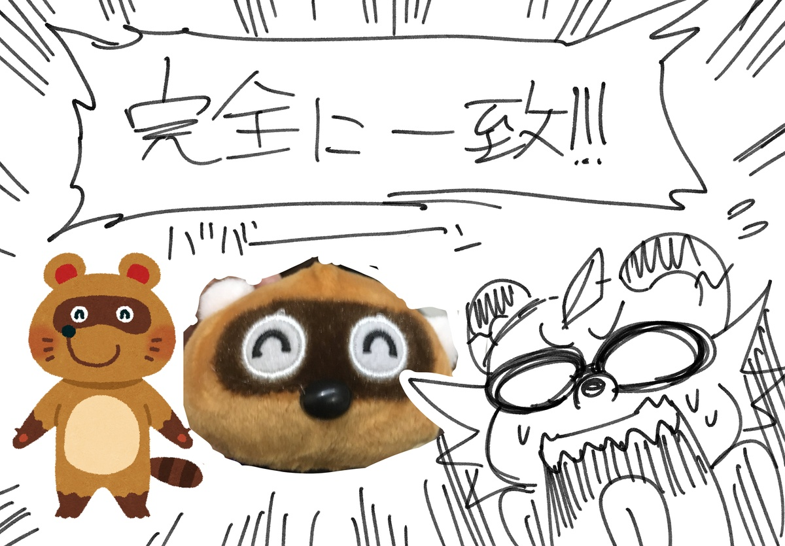

## それは紛れもなくいらすとや

 
 
 
 
 
 
 

本日はハノイ最終日。  
チェックアウト後も荷物預かってくれると言うことで、ぶらぶら歩いて軍事歴史博物館へ。  
隣接のカフェで朝飯を食べて博物館に。  戦車とか戦闘機とかいっぱいあった。  
ベトナム戦争のそれぞれの戦いを解説してる感じで、米軍の鹵獲品とか飾って良さげな感じ。  
  
そのあとは歩いて15分くらいの公安博物館へ、公安警察の仕事を紹介する感じのやつです。  
ユニフォームとか犯罪者の持ってた薬物とか武器とかの展示が。  
国家権力のかっこよさを表してる感じでとてもよいですね。  
警察は市民の味方！的なのがもうたまらん。  
  
上記の二箇所は写真多いので別途アップします。カメラ内RAW現像します。  
んで両替しに旧市街エリアへ。あと市場とかぶらぶら。長袖欲しかったのですが市場には良さげなのがないかんじ。  
セーターとかはあったんだけど、欲しいのはセーターではなくスポーツ生地とか綿なんだな。  
  
ないのでカフェに入ったり歩いたりなんかいろいろしてました。ヤギ肉を食べる予定なのでお昼は抜きました。  
  
そんな中市場の近くでたぬきのぬいぐるみを発見！！！！  
どこかで見たことある…これは…いらすとやのタヌキに似てる？！？？！？  
日本円で100くらいなので買いました。  
  
そんなヤギ肉を  食べに行こうとして通りがかった店にいい感じの長袖があったので買いました。

そしてヤギ焼肉。ヤギ肉と牛肉と野菜が乗って一人前500円くらい。  
日本みたいに網があるのではなく、網の上にアルミホイルを敷いてマーガリンをかけてその上で焼きます。  
もう油まみれや…。  
  
タレとかはなくライム汁か塩でいただきます。  
ヤギ肉、正直よく分からなかった……なんとも言えない、なんか肉だなーって…。  
  
それから宿に荷物を取りに行ってハノイ駅へ。  
ハノイ駅で夜食を買って乗り込みます。寝台です。  
  
明日の昼ごろダナンにつきます。およそ16時間くらい乗ります。  
途中で景色のいいところを通るみたいなので、うまくカメラに収められるといいな。  

- アイスコーヒーとバインミー:4万8千VND
- ベトナム戦争歴史博物館入場料(カメラ持ち込み料金込み):7万VND
- スタバっぽいコーヒー:5万9千VND
- 焼肉一人前:10万VND
- バイタク代合計:6万5千VND
- ノースフェイス的な長袖:25万VND
- 酔い止めの薬4回分:4万VND
- 列車に持ち込むおやつとか飲み物とか:5万VND