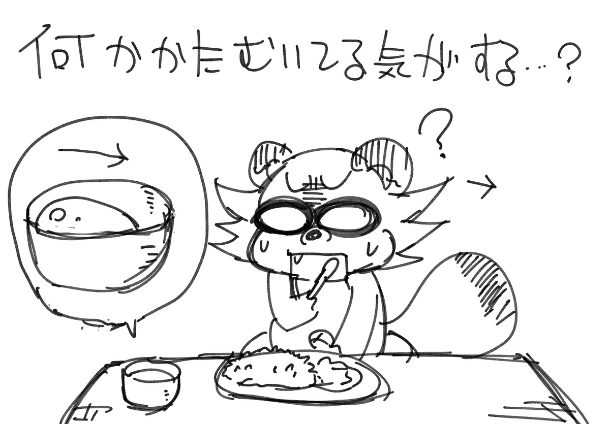
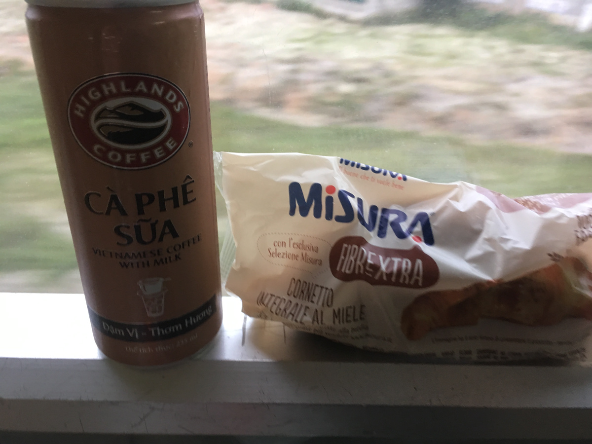
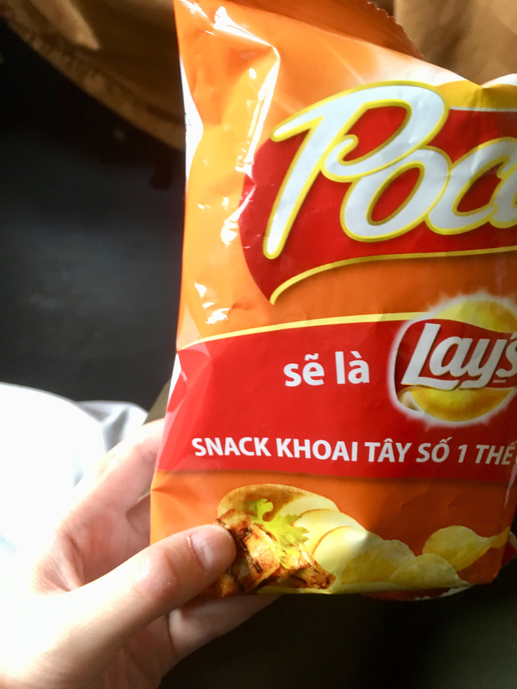
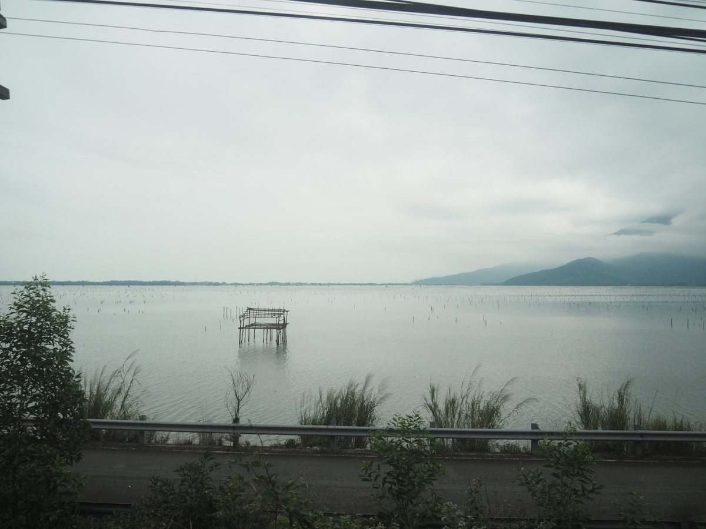
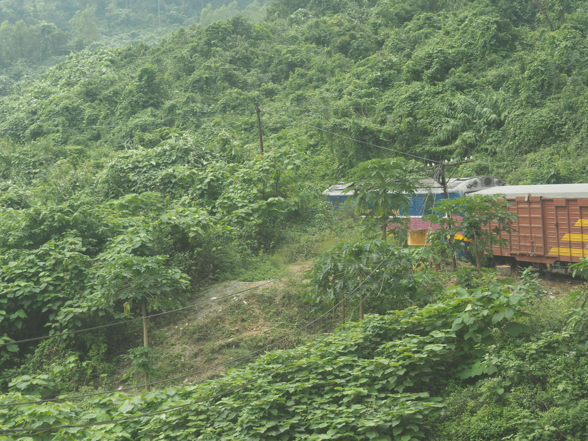
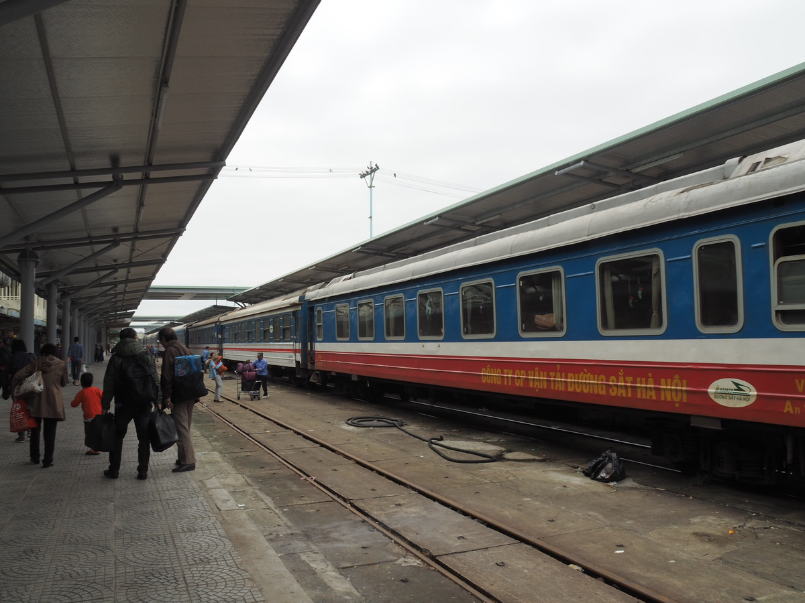
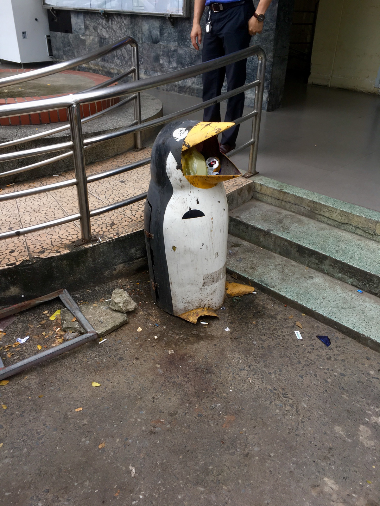
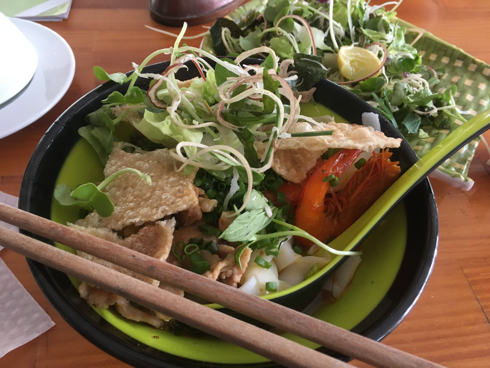
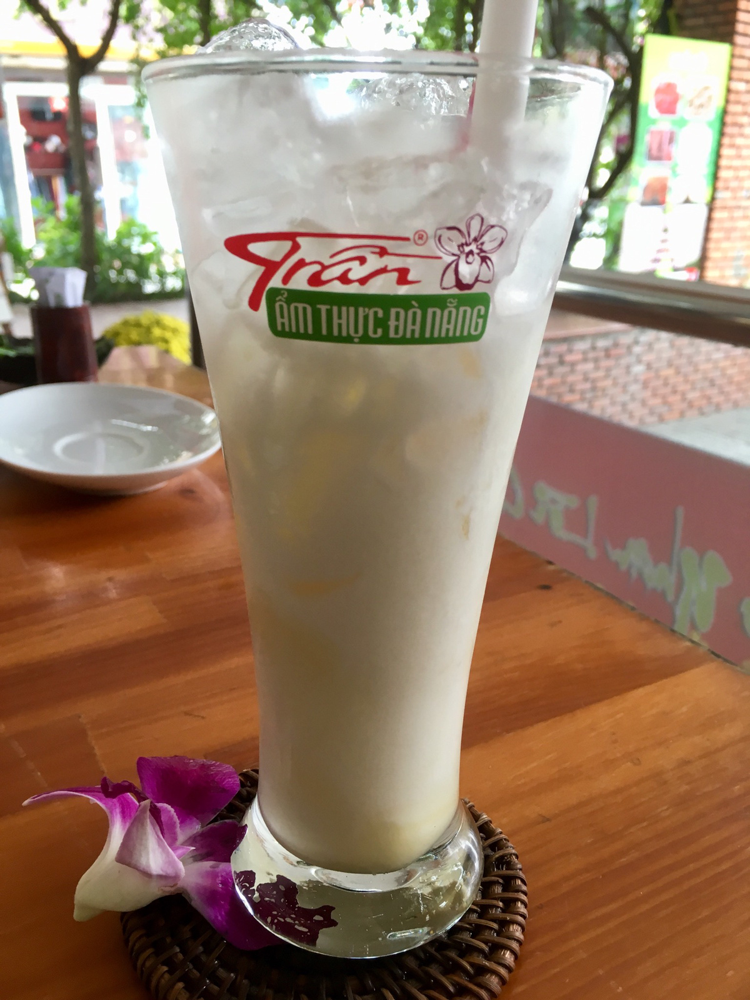
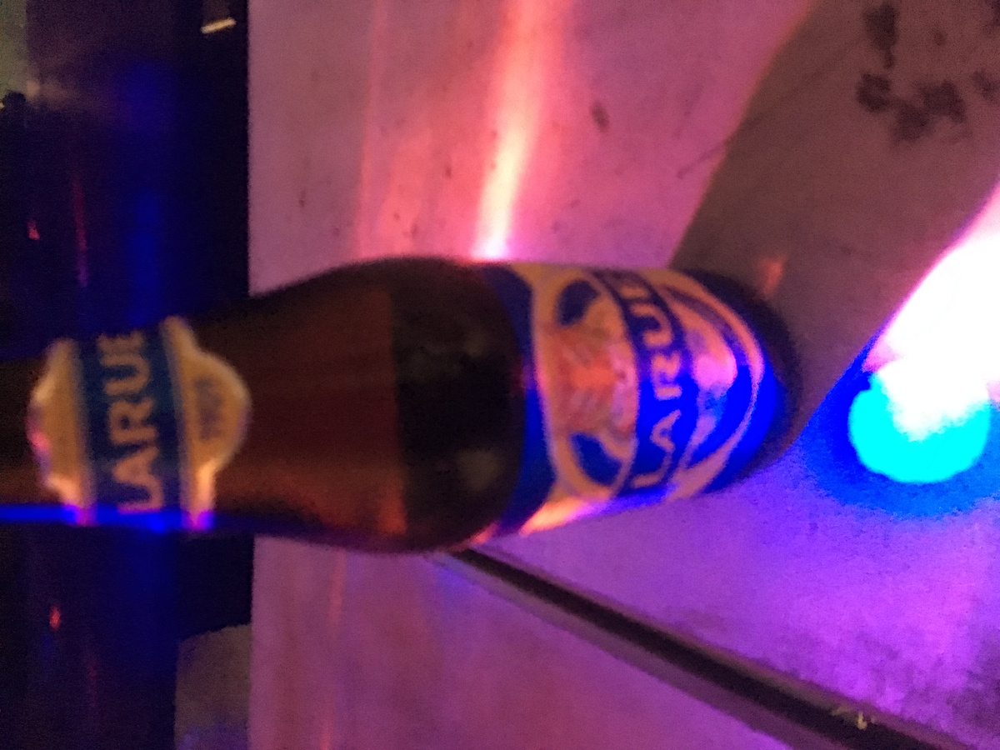

## 体が傾いてる気がする。

 
 
 
 
 
 
 
 
 
 
 
 

ダナン行きの電車であさごはん。昨日駅のキオスクで買っておいたパンとコーヒーです。  
隣の寝台のヨーロッパ人のにーちゃんが日本の冬かな？ってくらいエアコン効かせてて死ぬかと思った。  
  
フエとダナンの間は景勝地なので写真バリバリとりました。  
まあ目線の高さに電線があったり、天気がアレなので全然良くなかったけど！！！！  
  
昼過ぎにダナンに着く。  
駅前に謎のペンギン型のゴミ箱が…。口にゴミ詰められててかわいそうだった…。  
  
目星をつけてたゲストハウスにチェックインし昼飯。  
とにかく腹が減ったのでその辺で食べるとなんかすごい高かった…。  
まあ日本円で500円以内ではあるんですが。  
  
そのあとは宿で洗濯を依頼したり写真を整備したり荷物を片付けたりの作業。  
あとはシャワったりなんだり。  
  
そのあとは街ブラしつつ晩飯探し。  
ダナンは飯屋よりカフェが多いのでは？ってくらいカフェがある。  
屋台でコムガー売ってたのでほこで食べたのですが、なんだか机が傾いてる…。  
コムガーについてきたスープが傾いている…もしやこのテーブル傾いてるのでは？  
その旨を英語で伝えてもわからんの顔をされたので、傾いたまま食べる…。  
なんか体のバランスおかしくなりそう……。  
  
宿に帰るとなんか宿の人がルーフトップバーに行くとタダでビールもらえるぞと言ってたのでルーフトップバーへ。  
ただでビールもらった…。  
申し訳ないのでソフトドリンクとスナックを追加。  
  
宿のおねーちゃん(大学生くらい)と話す。  
ボツネームを見せたりしましたよ！！！  
あと動物の写真とか。ペンギン水族館の写真は東南アジアの人にウケが良いのだ。  
  
動物の話をしてたら、なんかダナンにはモンキーマウンテンがあるらしく、野生の猿が観れるとのこと。  
ズーラシアにもいるらしいけどズーラシア遠いし撮影して見たいので明日行きます。  
  
今日はそんな感じ。ついに長袖から半袖やで！あったかいっていいね！！！  

- ゲストハウス(ドミトリー)1泊:500円
- 洗濯代:6万VND
- ミークアンとヨーグルト飲料:9万7千VND
- 飲み物とかおやつ:2万3千VND
- コムガー:5万5千VND
- コーラとポテチ:3万5千VND
