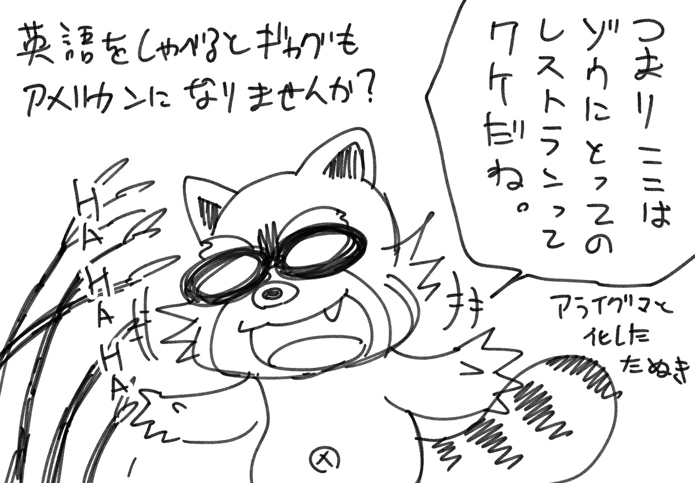
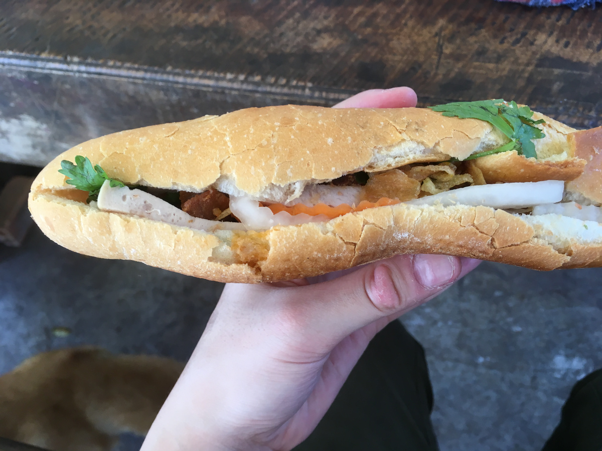
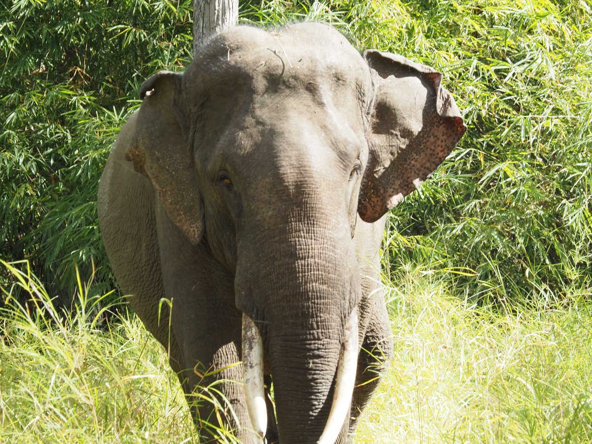
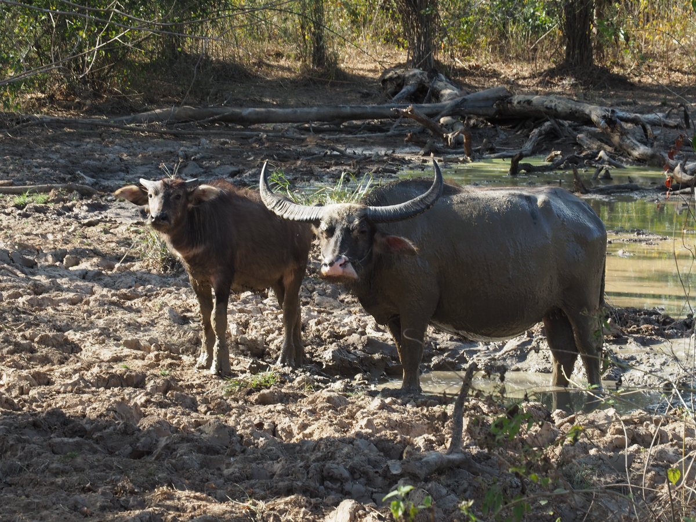
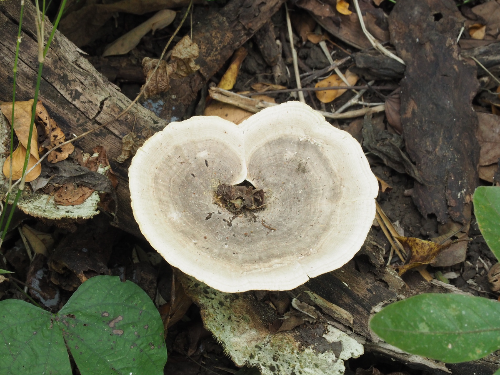
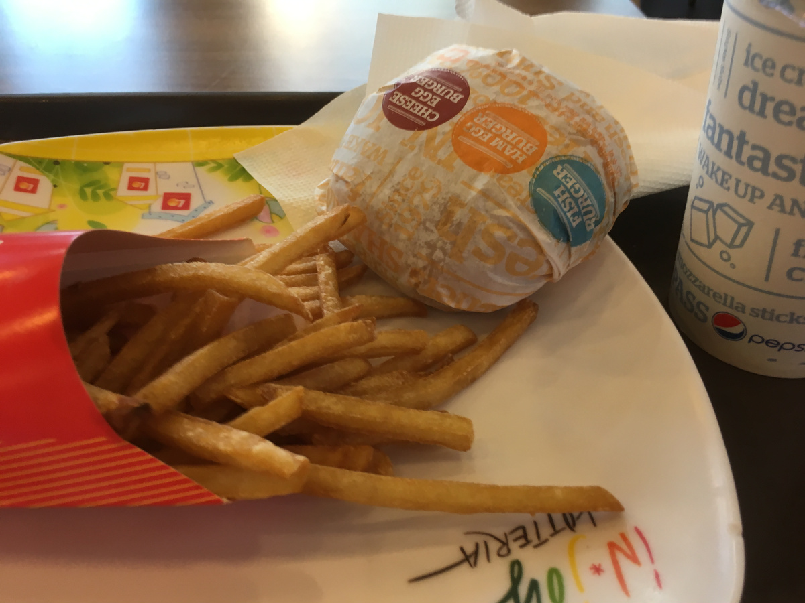

## HAHAHA!! ここはまるでゾウにとってのレストランだね。

 
 
 
 
 
 
 

早起きしてヨックドン国立公園へ。  
ローカルバスで行こうと思ったらバスがこない。  
疑問に思ってその辺の人に聞いたら、ベトナム語しか話せないようで、  
グーグル画像検索を駆使しつつ聞く。  
  
結果バスのルートが変わったそうで、そこまでバイタクで連れてってもらう。  
無事にバスをキャッチし国立公園へ。  

どうでもいいんだけど、バスなどで長距離移動するときは基本飯を軽めにするとか、飯を抜く。  
日本ほど道路が綺麗じゃないのでガタガタな道を進むわけで、その分車酔いしやすい。今回は朝を抜いた。  
  
今回はゾウツアー。バイクで外周を回りつつトレッキングやゾウが出そうなポイントで降りて森の中へ。  
森の中をザクザク歩いたり、簡単な小川をジャンプして超えたりする。  
  
んで午前はまずメスのゾウを発見。  
話を聞くと、ヨックドン国立公園には4匹のゾウがいて、狭い森からここに移転させられたゾウとか、ここで生まれたゾウがいるらしい。  
飼っているわけではないようだけど、象使いの人の顔は覚えているらしくついて行くそうだ。  
  
ゾウがいるので竹が死ぬほど生えている。  
  
それを見たワイ  
「ここはまるでゾウにとってのレストランだねHAHAHA」  
英語喋ってるとジョークも欧米になりませんか？？？？？？  
  
お昼にランチのバインミーを食べる。  
パーク内には所々レンジャーステーションがあって、そこで休憩できる。  
  
午後もそんな感じでトレッキングしながらゾウ探し。  
野生の鹿やバッファローを見たりもした。  
  
しかしなんというか森を見ていると「作画大変そうな森だなー」と思ってしまうのは漫画家のサガか！？  
  
結局ゾウを2匹、オスとメスをちゃんと見ました。  
写真めっちゃ撮ったのでRAW現像してツイッターとかにあげるかも。  
  
帰りのバスを待っていると、タクシーが止まる。  
英語でタクシーの相乗り相談だった。  
なんでも空港に学者さんを連れて行くのでそのついでに4万ドンで市街地までどうよ？的な話。  
オッケーして乗り込む。  
  
ヨックドン国立公園の近くには少数民族の街があって、そこに結構学者が来るそうで。  
ついでとは言え安くで行けてよかったぜ。  
  
バンメトート市内に戻って夕飯。ロッテリア。  
宿の人に相談して次に目的地、ニャチャンへにバスチケットを取り寝る。  

- バス片道:2万2千VND
- エレファントエクスペリエンスツアー:140万VND
- 帰りのタクシー:4万VND
- ロッテリアのセット:5万8千VND
- 水とかおやつとか:2万5千VND
- ニャチャンへのバスチケット(宿でピックアップしてくれる):20万VND
- 2泊分とランドリーサービス代:40万VND