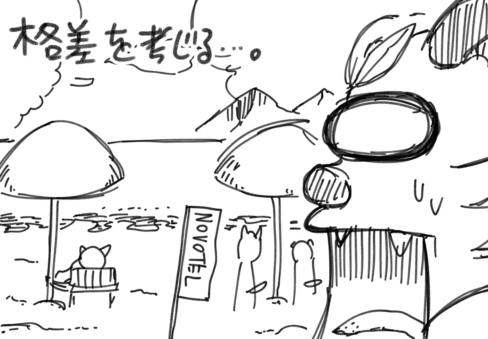
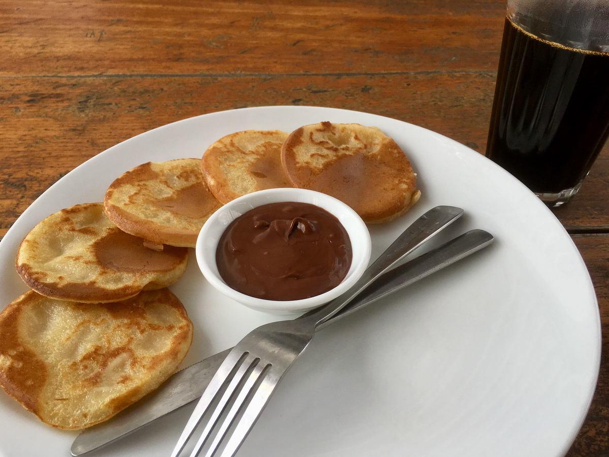
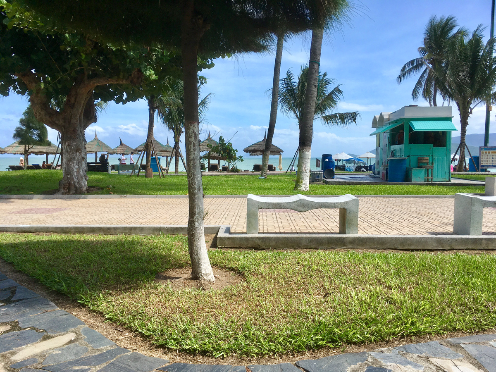
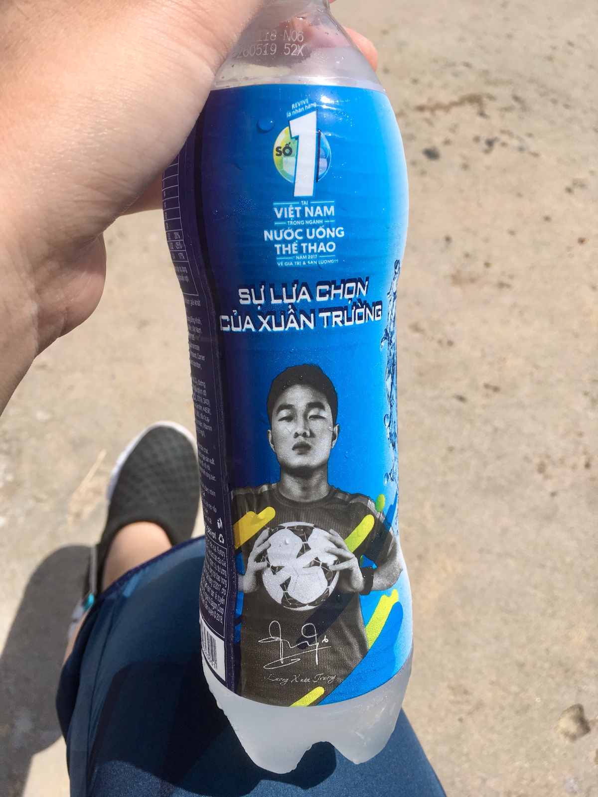
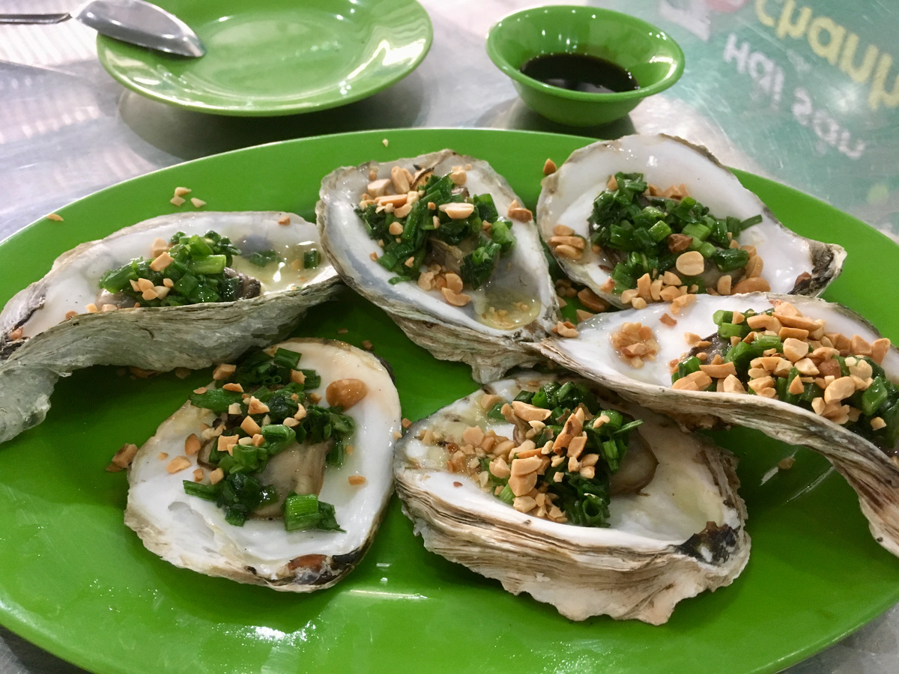
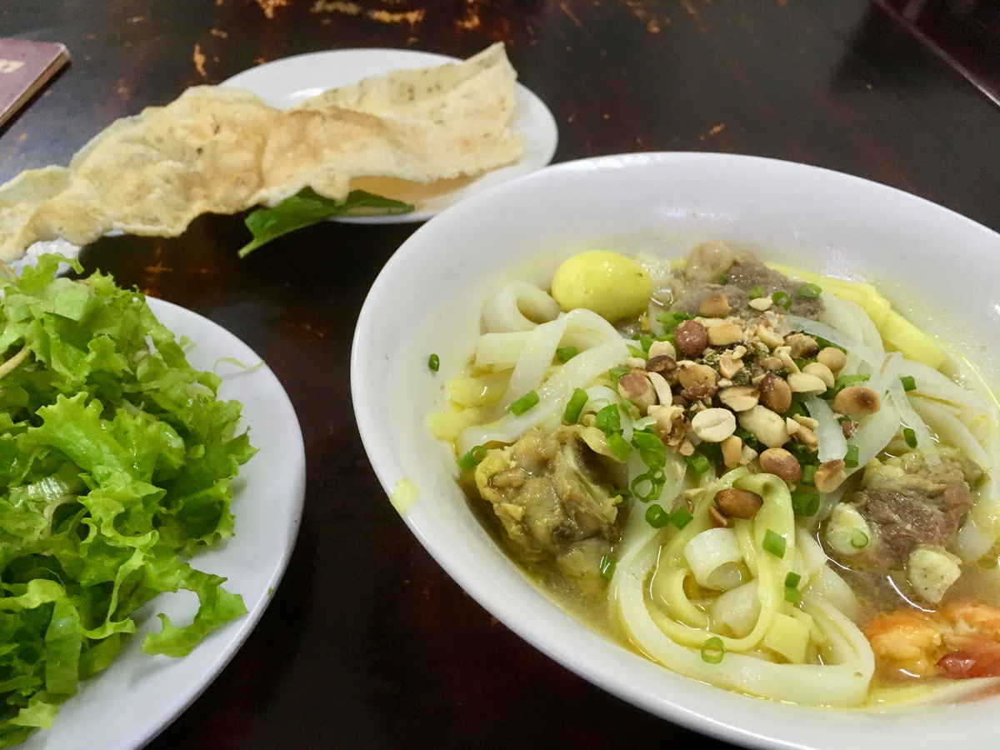

## 格差社会を感じる生活

 
 
 
 
 
 

本日もぐっすりからのおはよう。  
宿のルーフトップで朝食をやっているそうなので食べる。  
アメリカンなメニューしかないけど食べ慣れてるからまだいいよね。  
  
そのあとはビーチにお絵かきでもしに行こうと思ったら…どこもかしこもホテルの旗が立ってるプライベートビーチ。
砂にすら触れんのか…うせやろ…。  
ビーチに●●参上とか描きかかった…。  
  
ビーチ周辺をウロウロ。お供は微炭酸スポーツドリンク。  
ポカリとかアクエリアスが微炭酸になったやつ。  
東南アジアにはよくあるんですけどこういうの、すきだから日本でも売って欲しいなあ。  
昔あったアクエリアススパークリングとかすごい好きだった。  
  
それから牡蠣を食べる。流石に生牡蠣はアレなので焼きで。うまかったです。  
しかしこれくらいの牡蠣なら台湾高雄の旗津のほうが安いんじゃないかな。  
  
そのあとは宿でゴロゴロVPNのパワーを使ってもアマプラやあにてれは見れなかった…けもフレ2の1話を見たい…せめて……。
  
んでゴロゴロしてから晩飯。  
宿の人にミークアンが好きな話をしたら勧められた店へ。  
うまかった…！！！  
  
そして今に至ります。  
  
ちょっとさすがにやることなくなってきたので、1日1本プロット出しとかします。  
あったかい環境ならなんかうまいことできるでしょ…しらんけど。  

- 宿の朝食:4万VND
- 牡蠣のにんにく焼きなど:17万VND
- ミークアンなど:4万7千VND
- 飲み物とかおやつとか生活用品とか:5万VND