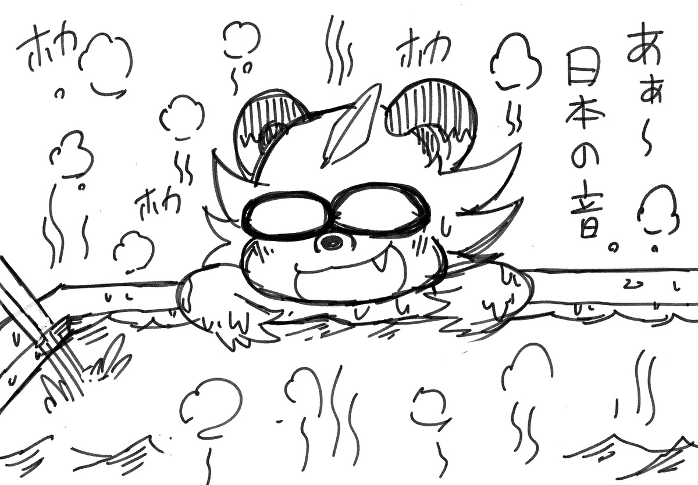
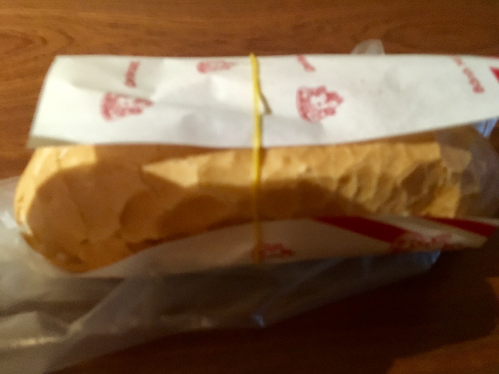
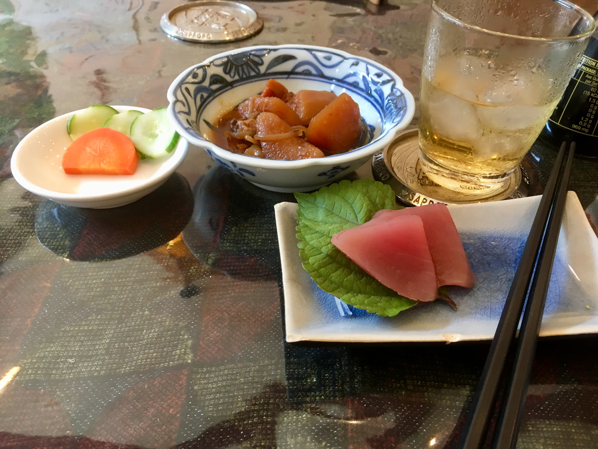
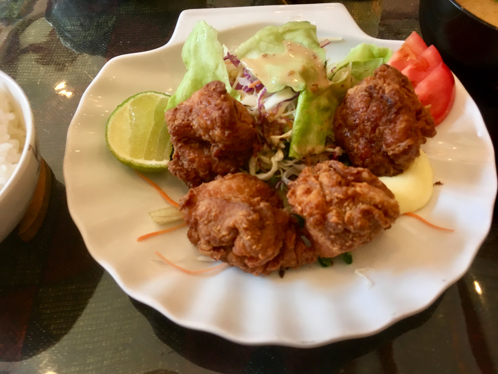
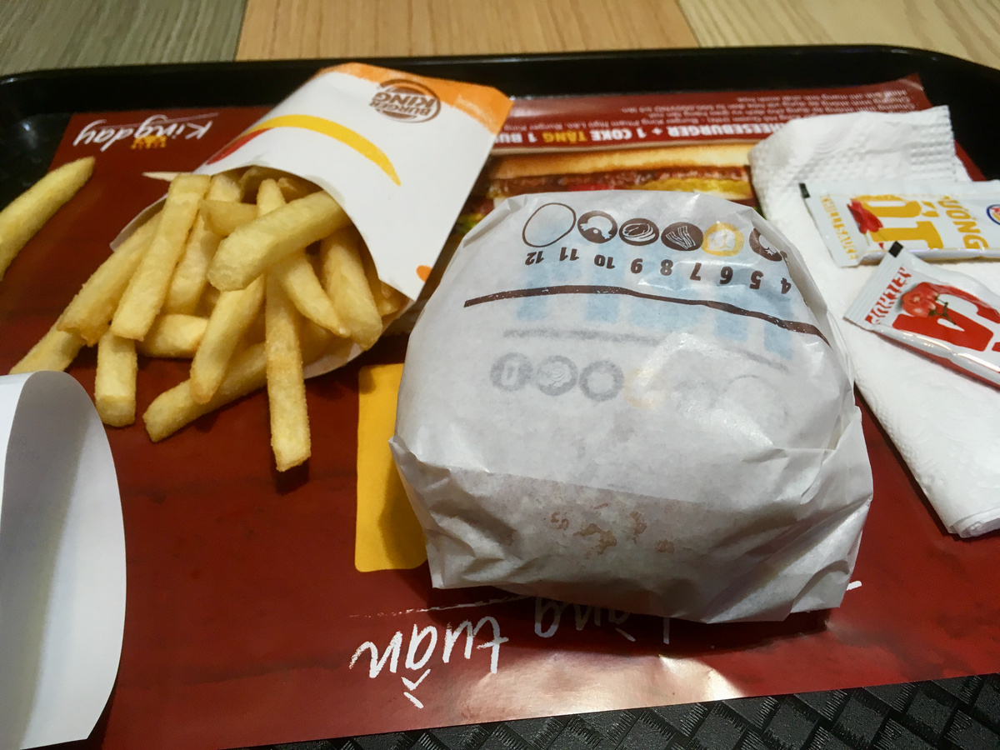

## あぁ〜日本の味

 
 
 
 
 

昨日の風邪は寝ることで倒せました。  
今の宿、露天風呂あるんで良いんですよー。  
  
今日は安静にすべく基本は宿でネット見たりなんだり調べ物したりしてました。  
  
朝はゲストハウスの人に紹介してもらったバインミー屋で朝ごはん。  
お昼は近所の日本食屋で唐揚げ定食！  
めちゃくちゃ日本の味…刺身も肉じゃがも付いてくる。  
おふくろの味…最高か？？  
  
んで昼も片付けたり洗濯したりしつつ安静に。  
胃を休める。  
  
夜はバーガーキングへ。バーガーキングは最低月1食べるので故郷の味。  
  
そんな感じで16の朝に帰るので明日がホーチミン最終日。  
お土産買って友達に会いに行ったりします。  
胃も治ったしね。  

- 卵とハムのバインミー:1万VND
- 唐揚げ定食:12万VND
- ハンバーガーコンボ:6万VND
- 飲み物とか:2万VND