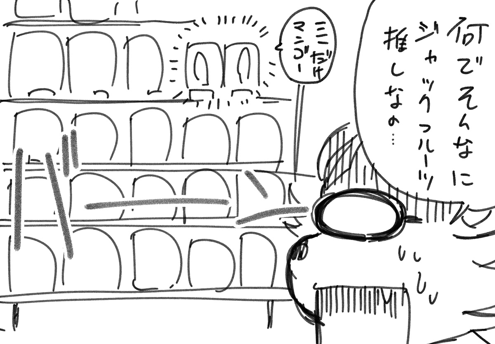
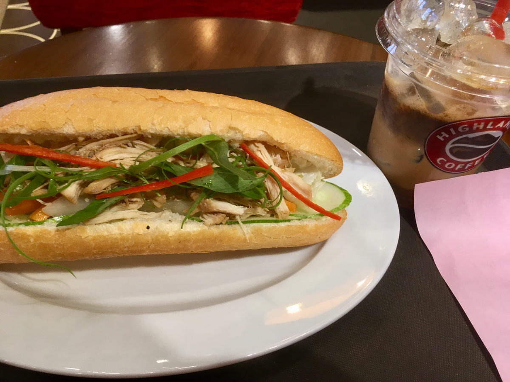
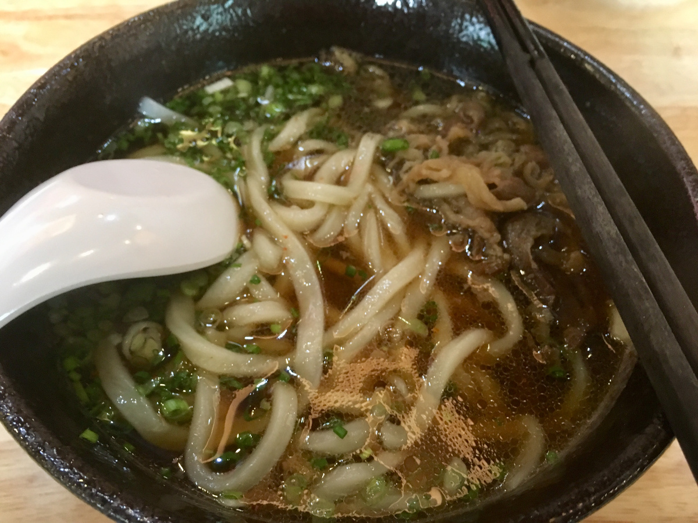
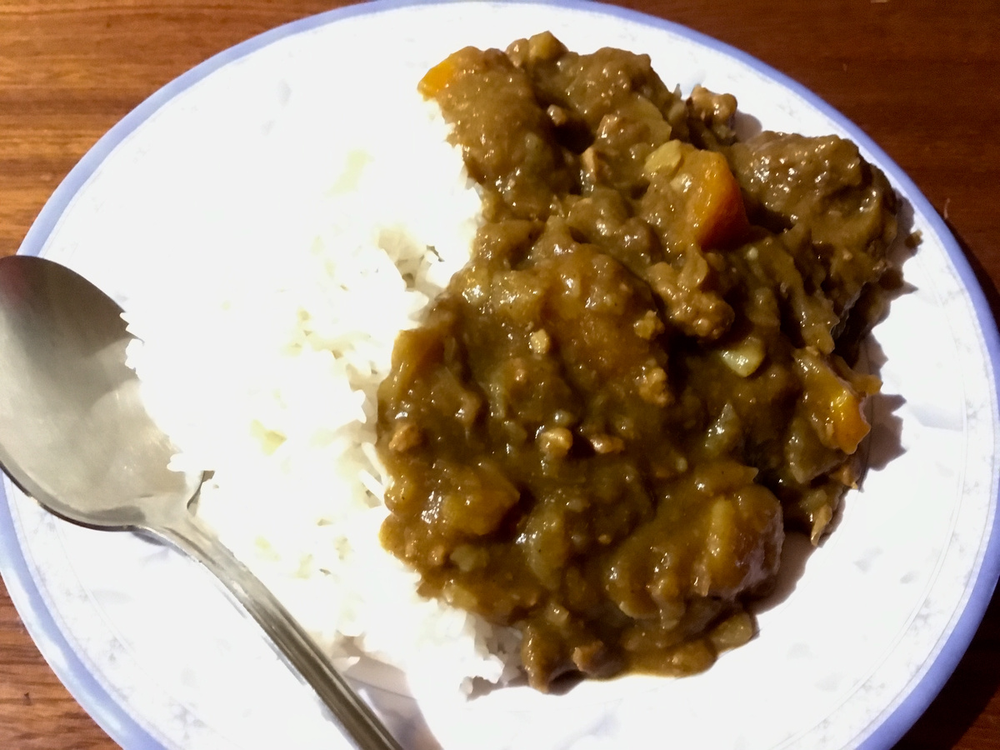

## ジャックフルーツ推しすぎ問題

 
 
 
 

本日ベトナム最終日！！！  
お土産購入デーです。  
  
朝ごはんに近所のカフェに行き例のごとくコーヒーとバインミーを。  
そのあとはスーパー的なところでお土産を買いました。  
  
お土産あるあるだと思うんですけど、変なお土産を買っても誰も手に取らないので、やはりここは南国らしく、ドライフルーツを購入……  
しようと思ったら、なんかドライフルーツが少ないでやんの！！！  
ジャックフルーツのチップスが激推しされてて、ドライマンゴー的なのが買えない……。  
  
小さいのを別の場所で見つけたので購入したのでよかったですが、買えなかったらマジでお土産に悩むところでした。  
  
お昼はゲストハウスの人たちがカレーを作っているのを横目に友人の家へ。  
ホーチミンに友人が住んでいまして。  
行くたびに会っては色々お話ししてる感じです。  
  
ついでに人吉うどんを食す。  
いやあ九州のうどんは出汁が最高ですね。  
長崎出身なので刺身醤油とかもちょっと甘口が好みだったりして、お腹が許せばつゆまで飲みたかった！！！！！！！！！
  
んでそのお友達から例のごとくダラット名産のお茶をいただく。1キロ買ったので1年くらい飲めそうですね。  
こちら小分けして各所に置いたりお土産にします。ホットだと香りが良いのでぜひぜひ……。  
  
宿に戻ってきてちょいとおやつを食べ、お昼に作っていたというカレーを食べました！！！！  
いやーいいよね、ジャパニーズスタイルカレー。  
最高だよね。  
肉もゴロゴロしててヨシ！！！！！  
胃が許せば(ry  
  
つーこってこれから帰国の準備をして寝ます。  
めちゃくちゃ寒い北京のために長袖を用意するぜ！！！！！！  

- コーヒーとバインミーのセット:4万5千VND
- おみやげ:28万VND
- 1年分のお茶:88万VND
- 往復のバイタク代:3万4千VND
- カレー代:5万VND